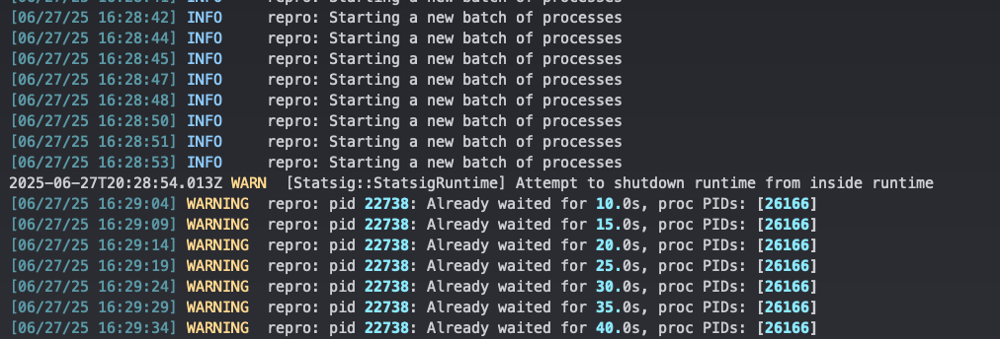
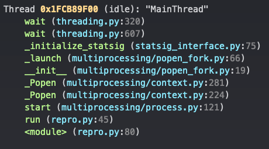

### Overview
This repository contains a script to demonstrate the Statsig SDK thread panicking in a forked process during init. 
The panic results in a lockup on version `0.5.0`. It can also be reproduced in version `0.4.2` but does not 
cause a lockup. 

The `repro.py` script runs a main thread with initialized Statsig. It then forks multiple times and gives each fork 
a very simple `pass` task to complete before closing. The SDK shuts down before each fork and re-initializes after 
each fork. The forks also initialize their own Statsig instances after being created. This way the parent thread and 
each fork end up with their own instances of Statsig. 

If the parent thread notices that a fork has been alive beyond the specified timeout for some reason, it will terminate 
all forks and restart the forking. The script will continue running until stopped. 

Logs are written to `repro_wrapped_<timestamp>.log` in the current directory.

---

### Setup

1. Clone the repo 

2. Create a `.env` at the repo root with your development Statsig SDK key:

   ```env
   STATSIG_SERVER_SDK_KEY=<your_dev_statsig_sdk_key>
   ```

3. Install `pyenv`

    ```shell
    brew install pyenv pyenv-virtualenv
    
    eval "$(pyenv init --path)"
    eval "$(pyenv virtualenv-init -)"
    ```

4. Install the virtual environment

    ```shell
    # from the repo root
    pyenv install 3.10.9
    pyenv virtualenv 3.10.9 klaviyo-statsig-panic-repro
    pyenv local klaviyo-statsig-panic-repro
    ```

5. Install the dependencies

    ```shell
    pip install -r requirements.txt
    ```

---

### Run

1. Run the script

    ```shell
    python3 repro.py
    ```
   
    If you want to adjust the fork timeout window (5 minutes by default), run the script directly in a Python shell:

    ```shell
    python3
    ```
   
    ```python
    from repro import run
   
    run(timeout=600)  # 10 minutes
    ```

2. Monitor the log output for [panic symptoms](#panic-symptoms)

3. To stop the script, `SIGTERM` the parent process by PID. Pressing `Ctrl+C` may also work.

---

### Logs

The init times from the log can be analyzed with `python3 analyze_log.py`. 
By default, the analyzer will pick the latest logfile. 

To check a specific log, provide the filename in a Python shell:

```python
from analyze_log import analyze_log

analyze_log("repro_wrapped_2025-07-10_15-57-01.log")
```

---

### Panic symptoms
After a few minutes, Statsig will panic in one of the forked processes. 


#### Version `0.5.0`
The thread panic is accompanied by the following log message:

```
WARN  [Statsig::StatsigRuntime] Attempt to shutdown runtime from inside runtime
```



The script will keep checking the fork status for up to 5 minutes by default, killing all forks if the timeout is 
exceeded. During the hang-up (within that timeout window), we can use `py-spy` or other profiling software to inspect 
the hanging process. `py-spy` shows that Python is stuck waiting for the Statsig SDK to finish initializing:

```shell
sudo py-spy dump --subprocesses --pid 26166
```



#### Version `0.4.2`
The thread panic does not cause a lockup, but the panic message is still logged:

```
thread 'statsig' panicked at /Users/runner/.cargo/registry/src/index.crates.io-1949cf8c6b5b557f/tokio-1.43.0/src/runtime/blocking/shutdown.rs:51:21:
Cannot drop a runtime in a context where blocking is not allowed. This happens when a runtime is dropped from within an asynchronous context.
note: run with `RUST_BACKTRACE=1` environment variable to display a backtrace
```
